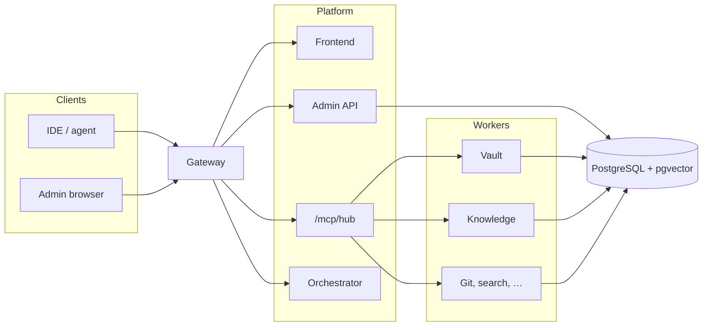

# mcp-team-hub

**One gateway. Shared MCP tools. Team admin.**

Self-hosted hub for the [Model Context Protocol](https://modelcontextprotocol.io/). IDEs and agents connect to a **single authenticated URL** instead of a pile of per-server configs. Operators get a web console for users, secrets, knowledge, and logs.

This repository is the **public documentation and Docker Compose install** — application source is not published here. Run it on your own host.

[](./LICENSE)
[](https://modelcontextprotocol.io/)
[](./docker-compose.yml)

[Русская версия](./README.ru.md) · [Architecture](./docs/architecture.md) · [Capabilities](./docs/capabilities.md) · [Images](./IMAGES.md)

---

## Why it exists

Most teams accumulate a dozen MCP servers in every editor: git here, search there, a tracker, a vault, a docs crawler. Tokens leak into env files. Nobody knows who enabled what.

**mcp-team-hub** puts that behind one gateway:

- one `/mcp/hub` endpoint for clients
- per-user tool sets in the admin UI
- provider tokens in an encrypted vault (not container env)
- knowledge and workspace memory next to the tools

---

## Features

- **Single MCP entry** — one URL and one vault access token for VS Code, JetBrains, Claude, and other MCP clients
- **Hub aggregator** — `hub_search` and namespaced tools (`kb_*`, `context_*`, `secrets_*`, `git_*`, …) without listing every worker in the client
- **Admin UI** — dashboard, per-user MCP catalog, knowledge, secrets, IDE connect, operational logs; admins also get users and analytics
- **Secrets vault** — encrypted provider credentials (Git, Jira, Figma, …) resolved at request time
- **Knowledge / RAG** — ingest URLs, crawl sites, hybrid search, embeddings
- **Workspace memory** — goals, decisions, facts, tasks, and notes scoped to a project
- **Code intelligence** — repository index, symbol search, call traces (when the module is enabled)
- **Team integrations** — git forges, trackers, Confluence, Figma, web search, Semgrep, and a larger worker suite
- **IDE pack** — connect page with config snippet plus optional skills/rules bundle
- **Self-hosted Compose** — public images on Docker Hub, one shared PostgreSQL (schema per worker)

---

## Architecture



The gateway is the only host port (`4300` by default). It serves the SPA, `/api`, `/orch`, `/mcp/hub`, and `/mcp/{server}`. Workers stay on the compose network. Details: [docs/architecture.md](./docs/architecture.md).

---

## Quick start

You need Docker Engine and Compose v2. Plan on about **4 GB RAM** for the full worker suite.

```bash
git clone https://github.com/melnikovit/mcp-team-hub.git
cd mcp-team-hub
cp .env.example .env
# Replace every change-me / changeme before a real deployment
docker compose pull
docker compose up -d
```

Open **[http://localhost:4300](http://localhost:4300)** and sign in with the bootstrap admin from `.env.example` (`admin@example.com` / `changeme`). Change that password before the stack leaves localhost.

```bash
curl -sS -o /dev/null -w "%{http_code}\n" http://localhost:4300/
```

Expect `200` (or a redirect).

---

## Connect an IDE

1. Sign in and open **IDE connect** (`/ide`).
2. Copy the hub URL and vault access token.
3. Add a single server to the client config:

```json
{
  "mcpServers": {
    "mcp-hub": {
      "url": "http://localhost:4300/mcp/hub",
      "headers": {
        "X-Vault-Access-Token": "<token-from-ui>"
      }
    }
  }
}
```

On a remote host use `https://your-domain.example/mcp/hub`. Use the `url` field — do not add a separate `type` / `serverUrl` unless your client requires it.

Reload MCP in the client, then start a **new** agent chat so `tools/list` is not stale.

More: [docs/capabilities.md](./docs/capabilities.md#ide-connect).

---

## Configuration

Copy [`.env.example`](./.env.example) and set at least:

| Area | Variables |
|---|---|
| Public entry | `GATEWAY_PORT`, `APP_PUBLIC_URL`, `CORS_ORIGINS` |
| Auth | `JWT_SECRET`, `BOOTSTRAP_ADMIN_*` |
| Vault | `VAULT_MASTER_KEY`, `VAULT_SERVICE_TOKEN` |
| Internal tokens | `GATEWAY_INTERNAL_TOKEN`, `ORCHESTRATOR_API_TOKEN`, `KNOWLEDGE_SERVICE_TOKEN` |
| Database | `POSTGRES_PASSWORD` |

**Provider tokens** (Git, Jira, Figma, search APIs, …) go into **Secrets** in the UI after login — not into compose env on a real deploy.

Your own domain:

```env
APP_PUBLIC_URL=https://your-domain.example
CORS_ORIGINS=https://your-domain.example
```

Terminate TLS on Caddy, nginx, or Traefik in front of the gateway.

Images: `melnikovit/mcp-team-hub-<component>:latest` — full list in [IMAGES.md](./IMAGES.md).

---

## Operations

```bash
docker compose ps
docker compose logs gateway --tail=100
docker compose logs api --tail=100
docker compose down          # stop; volumes stay
```

| Symptom | Check |
|---|---|
| UI does not load | `docker compose ps`, gateway logs, `GATEWAY_PORT` |
| Login fails | bootstrap vars in `.env`; a fresh volume is required to recreate the first admin |
| MCP tools empty | vault token in the client; user MCP set on `/mcp`; worker health |
| Web search empty | SearXNG up; connection stored in the vault |
| Port busy | change `GATEWAY_PORT` |

---

## What this repository is

| Included | Not included |
|---|---|
| README and extra docs | Application source |
| `docker-compose.yml` + `.env.example` | Private CI and registries |
| Postgres / SearXNG deploy snippets | Production IPs, SSH, vault tokens |

---

## License

[MIT](./LICENSE) © 2026 mcp-team-hub contributors
