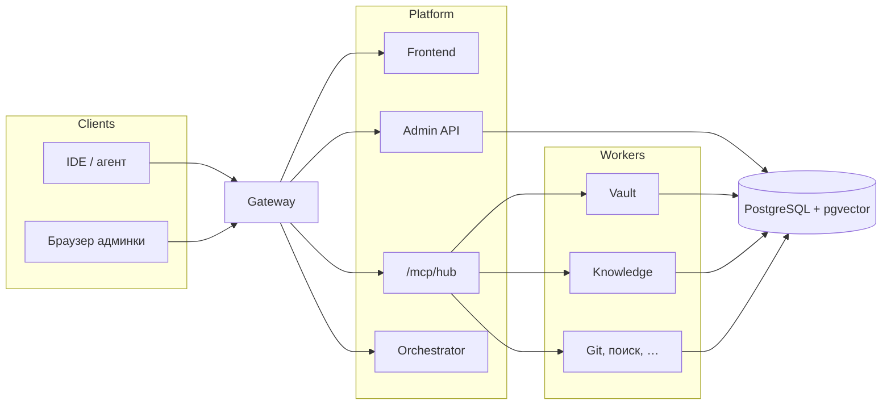

# mcp-team-hub

**Один gateway. Общие MCP-инструменты. Админка для команды.**

Self-hosted хаб для [Model Context Protocol](https://modelcontextprotocol.io/). IDE и агенты подключаются к **одному авторизованному URL**, а не к десятку отдельных серверов. Операторы получают веб-консоль: пользователи, секреты, база знаний, логи.

Этот репозиторий — **документация и установка через Docker Compose**. Исходники приложения сюда не публикуются. Поднимайте стек на своём хосте.

[](./LICENSE)
[](https://modelcontextprotocol.io/)
[](./docker-compose.yml)

[English README](./README.md) · [Архитектура](./docs/architecture.md) · [Возможности](./docs/capabilities.md) · [Образы](./IMAGES.md)

---

## Зачем это

Обычно в каждом редакторе копится зоопарк MCP: git, поиск, трекер, vault, краулер документации. Токены разъезжаются по `.env`. Непонятно, кому что включено.

**mcp-team-hub** собирает это за одним gateway:

- один вход `/mcp/hub` для клиентов
- набор инструментов **на пользователя** в админке
- токены провайдеров в зашифрованном vault, не в env контейнеров
- база знаний и память проекта рядом с tools

---

## Возможности

- **Единый MCP-вход** — один URL и один vault-токен для VS Code, JetBrains, Claude и других MCP-клиентов
- **Агрегатор hub** — `hub_search` и пространства имён (`kb_*`, `context_*`, `secrets_*`, `git_*`, …) без перечисления каждого воркера в клиенте
- **Админка** — дашборд, каталог MCP на пользователя, знания, секреты, подключение IDE, рабочие логи; у админа ещё пользователи и аналитика
- **Vault** — зашифрованные креды провайдеров (Git, Jira, Figma, …), резолв в момент запроса
- **Knowledge / RAG** — ingest URL, обход сайтов, гибридный поиск, embeddings
- **Память workspace** — цели, решения, факты, задачи и заметки в рамках проекта
- **Код** — индекс репозитория, поиск символов, трассы вызовов (если модуль включён)
- **Интеграции** — git-форджи, трекеры, Confluence, Figma, веб-поиск, Semgrep и расширенный набор воркеров
- **Пакет для IDE** — страница подключения с конфигом и опциональным бандлом skills/rules
- **Self-hosted Compose** — публичные образы Docker Hub, один PostgreSQL (отдельная schema на воркер)

---

## Архитектура



С хоста открыт только gateway (порт `4300` по умолчанию): SPA, `/api`, `/orch`, `/mcp/hub`, `/mcp/{server}`. Воркеры живут во внутренней сети Compose. Подробнее: [docs/architecture.md](./docs/architecture.md).

---

## Быстрый старт

Нужны Docker Engine и Compose v2. На полный набор воркеров заложите около **4 GB RAM**.

```bash
git clone https://github.com/melnikovit/mcp-team-hub.git
cd mcp-team-hub
cp .env.example .env
# Замените все change-me / changeme перед реальным деплоем
docker compose pull
docker compose up -d
```

Откройте **[http://localhost:4300](http://localhost:4300)** и войдите bootstrap-админом из `.env.example` (`admin@example.com` / `changeme`). Смените пароль, прежде чем выставлять стек наружу.

```bash
curl -sS -o /dev/null -w "%{http_code}\n" http://localhost:4300/
```

Ожидается `200` (или редирект).

---

## Подключение IDE

1. Войдите и откройте **Подключение IDE** (`/ide`).
2. Скопируйте URL хаба и vault-токен.
3. Добавьте **один** сервер в конфиг клиента:

```json
{
  "mcpServers": {
    "mcp-hub": {
      "url": "http://localhost:4300/mcp/hub",
      "headers": {
        "X-Vault-Access-Token": "<token-from-ui>"
      }
    }
  }
}
```

Для удалённого хоста: `https://your-domain.example/mcp/hub`. Поле — `url`, без лишнего `type` / `serverUrl`, если клиент сам определяет транспорт.

После смены конфига перезагрузите MCP в клиенте и откройте **новый** чат агента — иначе кэш `tools/list` останется старым.

Подробнее: [docs/capabilities.md](./docs/capabilities.md#ide-connect).

---

## Конфигурация

Подробная матрица «что в `.env`, что в vault»: [docs/configuration.md](./docs/configuration.md).

Скопируйте [`.env.example`](./.env.example) и задайте как минимум:

| Область | Переменные |
|---|---|
| Публичный вход | `GATEWAY_PORT`, `APP_PUBLIC_URL`, `CORS_ORIGINS` |
| Auth | `JWT_SECRET`, `BOOTSTRAP_ADMIN_*` |
| Vault | `VAULT_MASTER_KEY`, `VAULT_SERVICE_TOKEN` |
| Внутренние токены | `GATEWAY_INTERNAL_TOKEN`, `ORCHESTRATOR_API_TOKEN`, `KNOWLEDGE_SERVICE_TOKEN` |
| База | `POSTGRES_PASSWORD` |

**Токены провайдеров** (Git, Jira, Figma, поисковые API, …) храните в **Секретах** в UI после входа — не в env Compose на реальном деплое.

Свой домен:

```env
APP_PUBLIC_URL=https://your-domain.example
CORS_ORIGINS=https://your-domain.example
```

TLS завершайте на Caddy, nginx или Traefik перед gateway.

Образы: `melnikovit/mcp-team-hub-<component>:latest` — список в [IMAGES.md](./IMAGES.md).

---

## Эксплуатация

```bash
docker compose ps
docker compose logs gateway --tail=100
docker compose logs api --tail=100
docker compose down          # остановка; тома остаются
```

| Симптом | Что проверить |
|---|---|
| UI не открывается | `docker compose ps`, логи gateway, `GATEWAY_PORT` |
| Не логинится | bootstrap в `.env`; первый админ создаётся на свежем томе |
| Пустой список tools | vault-токен в клиенте; набор MCP на `/mcp`; здоровье воркеров |
| Нет web-search | SearXNG запущен; подключение в vault |
| Порт занят | смените `GATEWAY_PORT` |

---

## Что в этом репозитории

| Есть | Нет |
|---|---|
| README и дополнительные docs | Исходники приложения |
| `docker-compose.yml` + `.env.example` | Приватный CI и внутренние registry |
| Сниппеты Postgres / SearXNG | Прод-IP, SSH, vault-токены |

---

## Лицензия

[MIT](./LICENSE) © 2026 mcp-team-hub contributors
