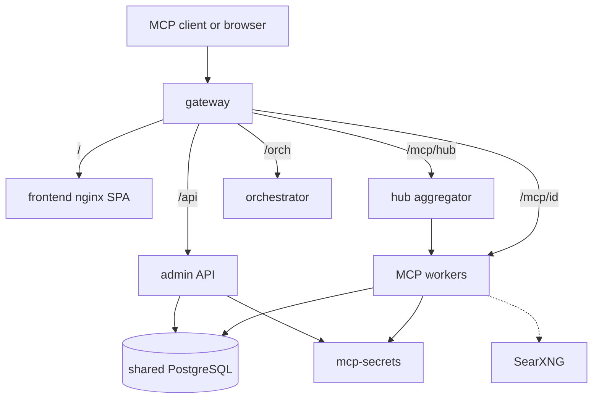

# Architecture

[README](../README.md) · [Русский README](../README.ru.md) · [Capabilities](./capabilities.md)

mcp-team-hub is a **gateway plus a suite of MCP microservices**. Clients never talk to workers directly.

## Request path

| Path | Upstream |
|---|---|
| `/` | Admin SPA |
| `/api/*` | JWT admin API (users, catalog, projects, IDE bundle, analytics) |
| `/health` | Gateway liveness |
| `/orch/*` | Orchestrator (Docker helpers; prefix stripped) |
| `/mcp/hub` | Aggregator: `tools/list` fan-out, knowledge-first `hub_search` |
| `/mcp/{server}` | Direct worker (same vault header) |

Every MCP route requires `X-Vault-Access-Token`. The vault is **always on** and hidden from the IDE catalog — it is infrastructure, not a user-facing tool list.

## Data

One PostgreSQL instance (`pgvector`) with **one schema per worker**:

| Schema | Owner |
|---|---|
| `public` | Admin API |
| `secrets` | Vault |
| `knowledge` | Knowledge / RAG |
| `web_search` | Web search cache |
| `git` | Git connections / audit |
| `context` | Workspace memory |
| `codebase_memory` | Code graph |
| `jira`, `confluence`, … | Matching workers |

Do not add a Postgres container per MCP. New SQL workers use `DATABASE_URL` + `DB_SCHEMA`.

## Auth model

1. User signs in to the admin UI (bootstrap admin or later accounts / optional OIDC).
2. UI issues or rotates a **vault access token**.
3. The IDE sends that token on every hub call.
4. Gateway authorizes the user and the enabled MCP set.
5. Workers resolve provider credentials from the vault (`vault_fallback`), not from their own env.

## Deploy shape

Public install uses **prebuilt images** (`melnikovit/mcp-team-hub-*`) and the Compose file in this repo. Put a reverse proxy with TLS in front of the gateway if you expose the stack beyond localhost.

Third-party images:

- `pgvector/pgvector` — database
- `searxng/searxng` — meta-search for the web-search worker
